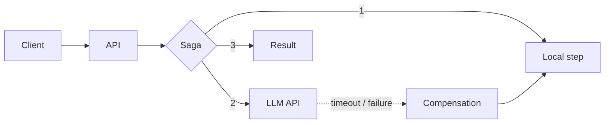

<h1 align="center">Juan H. Paes</h1>

  <strong>Back-End Engineer · Tech Lead</strong> 
  Software architecture, microservices and AI systems in production.

🇺🇸 English · <a href="README.md">🇧🇷 Português</a>

---

## About

I'm **Tech Lead at V-Lab UFPE**, where I define the architecture and system design (scalability, service integration, security) and the team's development standards. I'm also a **back-end engineer at Machlev Smart Applications**, moving legacy systems to microservices and integrating AI with resilience.

I like simple, robust, observable solutions. I'm pursuing a degree in Information Systems at UFPE.

## What I do

- **AI systems:** LLM API integration with the Saga pattern, handling provider failures and timeouts.
- **Architecture and system design:** microservices, event-driven async communication, incremental monolith migration.
- **RESTful APIs** in PHP, Node.js/TypeScript and Nest.js.
- **Infrastructure:** Kubernetes (K3s), Linux, Nginx, OpenStack, observability.
- **Technical leadership:** coding standards, Git, code review and Scrum workflow.

## Cases

**🤖 AI in production (Machlev)**
Integrated AI features through LLM APIs. Instead of relying on distributed transactions, I used the **Saga pattern** to coordinate compensable steps, with failure and timeout handling, keeping the system working even when the provider is down.

**🏗️ Monolith → microservices (Machlev)**
Set up a **K3s** cluster with ingress and CPU, RAM and I/O monitoring, and decoupled critical modules into microservices with **HPA**. Region by region, I migrate the legacy system with **Strangler Fig**, without interrupting production or betting on a full rewrite. I also restructured directories with over 1 million files, fixing Ext4 cold-lookup bottlenecks and optimizing rsync backups.

**🧭 Technical leadership (V-Lab UFPE)**
Architecture with React, Nest.js, Oracle and Nginx (SPA + reverse proxy), coding and versioning standards, Moodle plugins, and hands-on work in requirements and business rules.

**🏋️ [FitCore](https://github.com/orgs/fitcore-org/repositories) (academic)**
Gym management platform in microservices with RabbitMQ, API Gateway, Eureka, JWT, AI services (sentiment analysis and time-series financial forecasting) and observability with Prometheus and Grafana.

**🌐 [CInbora Transparecer](https://cinboraimpactar.cin.ufpe.br/cinboratransparecer)**
RESTful API in Node.js/TypeScript for an NGO transparency portal (UFPE and Recife City Hall partnership), with JWT, S3, Jest tests and GitHub Actions CI. Also acted as Product Owner.

## Resilient AI pattern

## Stack

Also: Python, Java/Kotlin, Go, RabbitMQ, Redis, PostgreSQL, MariaDB, Docker, Prometheus, Grafana.

## Now

Going deeper into software architecture, distributed systems, observability and applied AI.

## Contact

[LinkedIn](https://www.linkedin.com/in/juan-henrique-0588a0325) · [Email](mailto:juan.henrique.paes@gmail.com)
