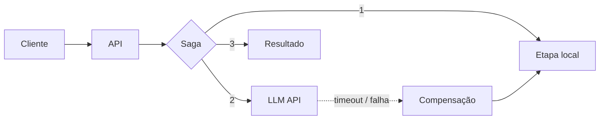

<h1 align="center">Juan H. Paes</h1>

  <strong>Engenheiro Back-End · Tech Lead</strong> 
  Arquitetura de software, microsserviços e sistemas de IA em produção.

<a href="README.en.md">🇺🇸 English</a> · 🇧🇷 Português

---

## Sobre

Sou **Tech Lead** em um laboratório de software da UFPE, onde defino a arquitetura e o system design (escalabilidade, integração entre serviços, segurança) e os padrões de desenvolvimento da equipe. Em paralelo, atuo como **engenheiro back-end** em uma empresa de software, levando sistemas legados para microsserviços e integrando IA com resiliência.

Gosto de soluções simples, robustas e observáveis. Curso Sistemas de Informação na UFPE.

## O que faço

- **Sistemas de IA:** integração de LLMs via API com padrão Saga, tratamento de falhas e timeouts do provedor.
- **Arquitetura e system design:** microsserviços, comunicação assíncrona por eventos, migração incremental de monólitos.
- **APIs RESTful** em PHP, Node.js/TypeScript e Nest.js.
- **Infraestrutura:** Kubernetes (K3s), Linux, Nginx, OpenStack, observabilidade.
- **Liderança técnica:** padrões de código, Git, revisão de código e gestão de fluxo com Scrum.

## Cases

**🤖 IA em produção**
Integrei funcionalidades de IA via APIs de LLMs. Em vez de depender de transações distribuídas, usei o **padrão Saga** para coordenar etapas compensáveis, com tratamento de falhas e timeouts, mantendo o sistema funcional mesmo com o provedor indisponível.

**🏗️ Monólito → microsserviços**
Implementei um cluster **K3s** com ingress e monitoramento de CPU, RAM e I/O, e desacoplei módulos críticos em microsserviços com **HPA**. Região por região, migro o legado com **Strangler Fig**, sem interromper a produção nem apostar numa reescrita completa. Também reestruturei diretórios com mais de 1 milhão de arquivos, resolvendo gargalos de cold lookup no Ext4 e otimizando backups com rsync.

**🧭 Liderança técnica**
Arquitetura com React, Nest.js, Oracle e Nginx (SPA + proxy reverso), padrões de código e versionamento, plugins Moodle e participação direta em requisitos e regras de negócio.

**🏋️ [FitCore](https://github.com/orgs/fitcore-org/repositories) (acadêmico)**
Plataforma de academias em microsserviços com RabbitMQ, API Gateway, Eureka, JWT, serviços de IA (análise de sentimento e previsão financeira com séries temporais) e observabilidade com Prometheus e Grafana.

**🌐 [CInbora Transparecer](https://cinboraimpactar.cin.ufpe.br/cinboratransparecer)**
API RESTful em Node.js/TypeScript para o portal de transparência de ONGs (parceria UFPE e Prefeitura do Recife), com JWT, S3, testes com Jest e CI no GitHub Actions. Atuei também como Product Owner.

## Padrão de IA resiliente

## Stack

Também: Python, Java/Kotlin, Go, RabbitMQ, Redis, PostgreSQL, MariaDB, Docker, Prometheus, Grafana.

## Agora

Aprofundando arquitetura de software, sistemas distribuídos, observabilidade e IA aplicada.

## Contato

[LinkedIn](https://www.linkedin.com/in/juan-henrique-0588a0325) · [Email](mailto:juan.henrique.paes@gmail.com)
